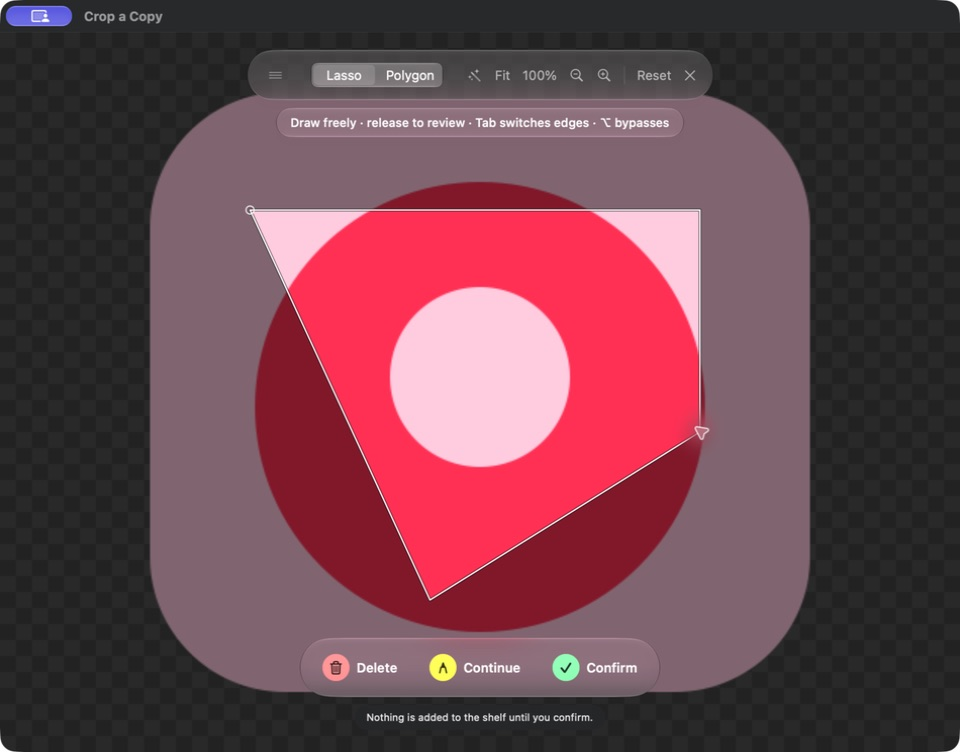

# SnipShelf

A native macOS design clipping shelf with Liquid Glass, freehand and polygon selection, edge assistance, and local image storage. Requires macOS 26 or newer.



- [Full usage and development guide](work/SnipShelf/README.md)
- [Validation results and known limitations](work/SnipShelf/VALIDATION.md)
- [Swift package](work/SnipShelf/Package.swift)

## Build and run

With Xcode installed, from this repository root:

```sh
./work/SnipShelf/script/build_and_run.sh
```

To build without launching, append `--build`. To run the tests:

```sh
DEVELOPER_DIR=/Applications/Xcode.app/Contents/Developer swift test --package-path work/SnipShelf
```

Source, tests, assets, and documentation are under `work/SnipShelf/`. Build caches, local QA data, release backups, and packaged outputs are excluded from Git.

MIT licensed. All image processing and storage are on-device; no accounts, cloud uploads, or analytics.
