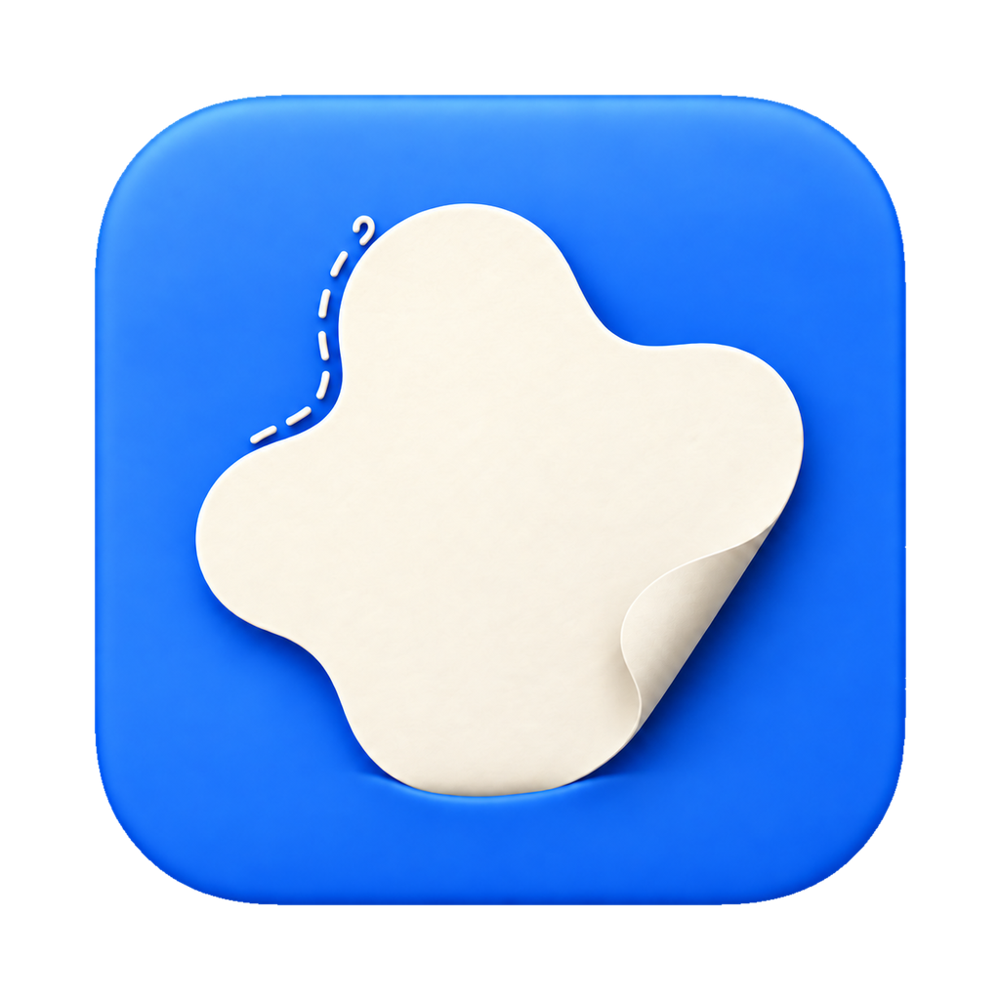
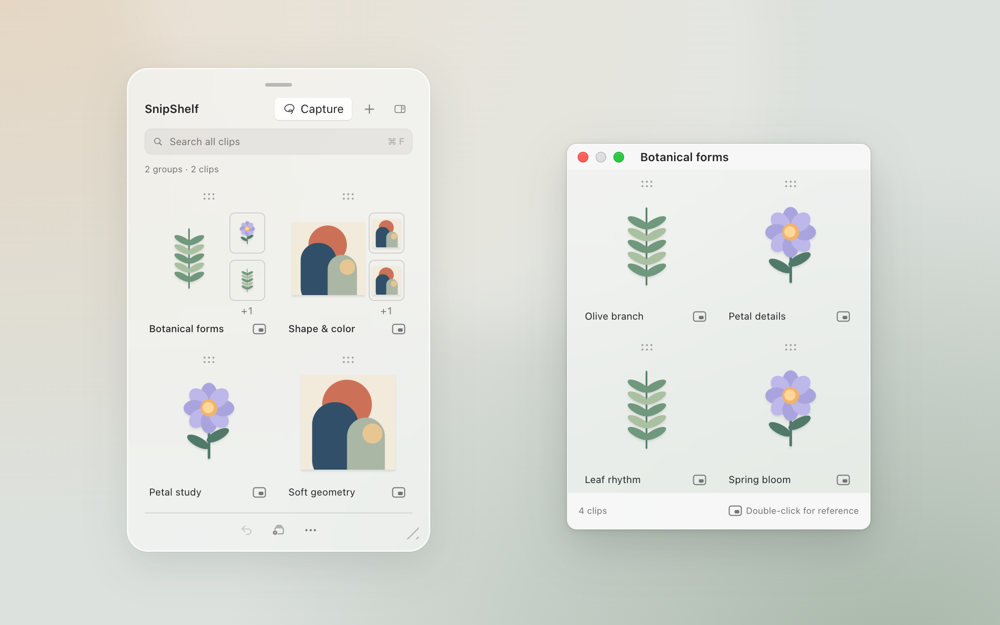
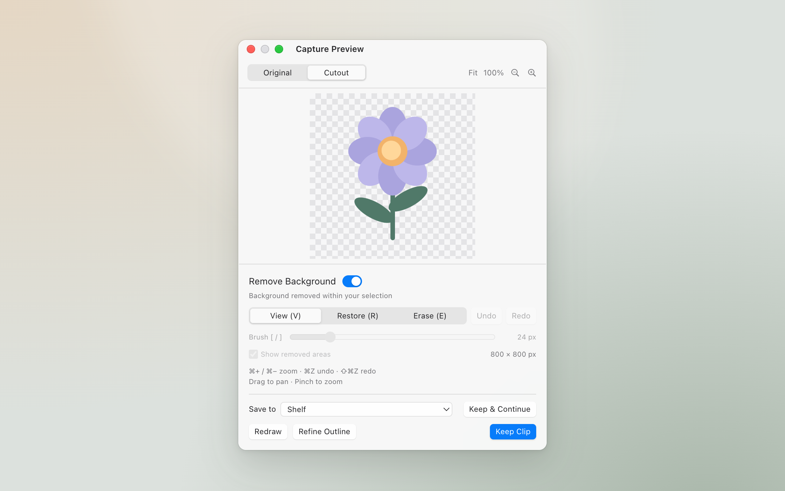
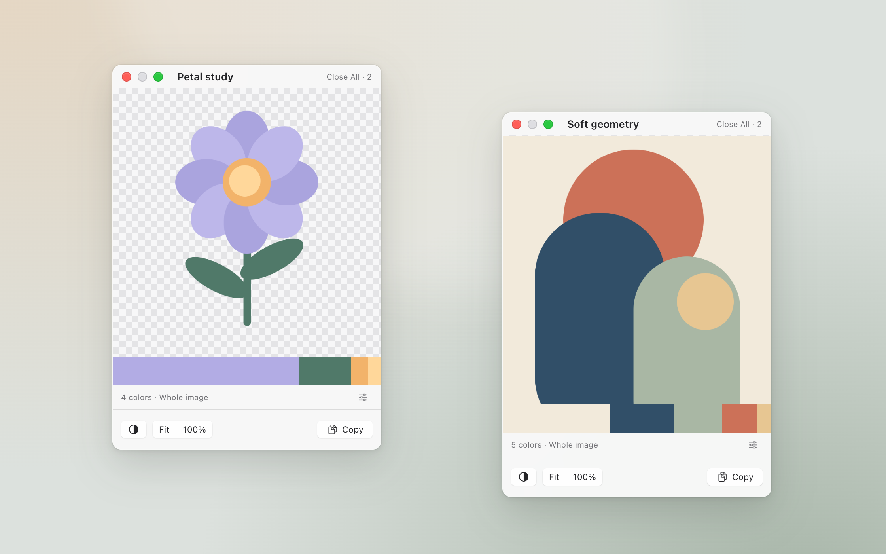
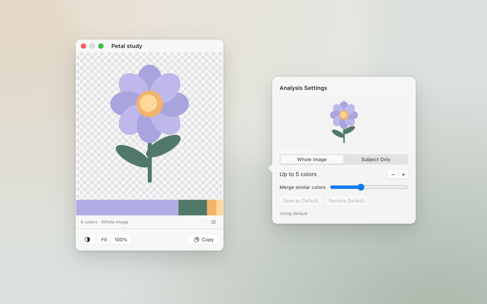

<p align="center">
  
</p>

<h1 align="center">SnipShelf</h1>

<p align="center">
  <strong>Keep the part you love.</strong><br>
  A native Mac shelf for cutouts, references, and visual ideas.
</p>

<p align="center">
  <a href="https://github.com/0xH4KU/SnipShelf/releases/latest"><strong>Download for Mac</strong></a>
  · <a href="#get-started">Get started</a>
  · <a href="docs/usage.md">Usage guide</a>
</p>

<p align="center">macOS 26+ · Apple Silicon · Free · MIT licensed</p>

<p align="center"><sub>Explore SnipShelf 0.3.0 through HTML interface previews.</sub></p>

## A place for every reference

Collect the details you want to come back to. Keep related images in groups,
find them with search, and tuck the shelf against the screen edge when you need
more room to work.



## Keep just the part you want

Draw around an element, remove its background, and review the transparent cutout.
Use Restore and Erase to touch up the result, then **Keep Clip** or
**Keep & Continue** to collect another detail from the same image.



## Keep it beside your work

Open an image or an entire group in its own floating window. References stay
above your other apps, with their own position, size, and background. Copy or
drag an image into your work whenever you need it.



## Take the colors with you

See the colors in a reference at a glance. Click a swatch to copy its HEX,
choose the subject or the whole image, and save your preferred analysis settings.



<details>
<summary>Explore the HTML interface preview locally</summary>

Open [docs/demo.html](docs/demo.html) in a browser, or run this from the repository root:

```sh
open docs/demo.html
```

Switch between Shelf, Capture Preview, References, and Color Palettes. The
preview includes light/dark appearance, sample search and groups, capture review
states, and HEX copying. Screen capture, painting, and image analysis run in the
Mac app. No web build or dependencies are needed.

</details>

## Get started

1. [Download the latest release ZIP](https://github.com/0xH4KU/SnipShelf/releases/latest),
   unzip it, and move **SnipShelf.app** into **Applications**.
2. Open the app and look for SnipShelf in the **menu bar**. It has no Dock icon.
3. Press **Command–Shift–2**, draw around a detail, and choose **Keep Clip**.
4. Select the clip and press **Shift–Command–P** to pin it, or drag it into your work.

The latest download is **v0.3.0**, including color palettes, search, Rectangle
capture, Keep & Continue, and library backup/recovery.
See the [release notes](docs/releases/0.3.0.md) for details and upgrade guidance.

**First launch:** the app is ad-hoc signed and not notarized. If macOS blocks
it and you trust the download, try opening it once, then go to
**System Settings → Privacy & Security → Open Anyway**.
[Apple's instructions](https://support.apple.com/102445) explain the steps.

**Screen capture permission:** allow SnipShelf in
**System Settings → Privacy & Security → Screen & System Audio Recording**
when prompted. Importing images and using **Crop a Copy** work without this
permission, so you can start with an image you already have.

All image processing and storage stay on your Mac. No account, uploads,
analytics, or subscription. See the [usage guide](docs/usage.md) for shortcuts,
organization, and data recovery.

## Build from source

Requires Xcode with the macOS 26 SDK or later. From the repository root:

```sh
./scripts/build_and_run.sh
```

This builds, ad-hoc signs, and opens `dist/SnipShelf.app`. Local builds have been
tested on Apple Silicon. See the [development guide](docs/development.md) for
tests, release packaging, Palette Lab, and Snip Lab, or the
[validation notes](docs/validation.md) for verified behavior and current limits.

## Feedback and license

[Open an issue](https://github.com/0xH4KU/SnipShelf/issues) with ideas or bugs.
For bugs, include your macOS version, SnipShelf version or commit, and steps to reproduce.

Free to use, modify, and share under the [MIT license](LICENSE).
