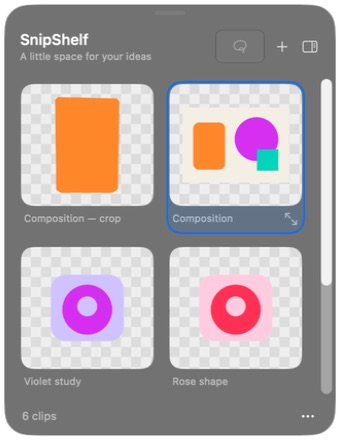
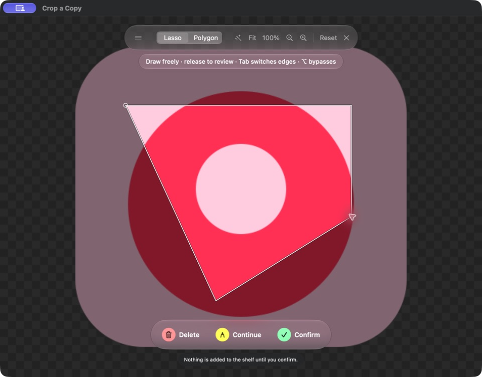

# Using SnipShelf

**Keep the part you love.** A free, native macOS shelf for the visual pieces of your creative work.

Draw a lasso or polygon around an element, keep the transparent cutout nearby, and drag it into your work. Built with SwiftUI, AppKit, ScreenCaptureKit, and the native Liquid Glass material. No third-party dependencies, account, uploads, analytics, or subscription.

## Requirements and first launch

- macOS 26 or newer. The 0.2.0 release ZIP supports Apple Silicon (arm64).
- Unzip the download and move `SnipShelf.app` to Applications.
- Open `SnipShelf.app`. It lives in the menu bar; there is no Dock icon.
- Start a capture from the menu bar or press **Command–Shift–2**. If macOS asks, allow screen recording in **System Settings → Privacy & Security → Screen & System Audio Recording**. If the system requests a relaunch, quit and reopen the app.
- Image import and recropping work without screen-recording permission.
- **Control–Command–1** starts Lasso, **Control–Command–2** starts Polygon, and **Control–Command–3** starts Rectangle. **Command–Shift–2** uses your last tool. These are global shortcuts, available while working in another app; the menu bar also offers each tool.
- Settings → Capture lets you customize each shortcut independently: a single letter, function key, or any combination of Shift, Option, Control, and Command. No modifier is required. Shortcuts work globally; plain Escape cancels recording. Conflicts appear in Settings and keep the previous working binding. An existing selection or preview is brought forward without changing its tool or discarding work; an empty canvas switches tools immediately.

This build uses an **ad-hoc signature**, with no developer certificate, and is
**not notarized**. If Gatekeeper blocks your first launch, and you trust this
download, open **System Settings → Privacy & Security → Open Anyway**, then
confirm the launch. See [Apple's instructions](https://support.apple.com/102445).
Managed Macs may restrict this exception. You can also build from source.

## Selection and review

- Releasing a lasso (or finishing a polygon) hides the capture editor and opens a compact **Capture Preview** near the selection. The desktop becomes visible again. The preview stays visible when focus changes; Capture brings an unfinished selection back to the front. Nothing is stored until you press **Keep Clip** or Return; Escape or the preview's close button cancels.
- **Remove Background** starts on for Lasso and Polygon, and off for Rectangle. Rectangle remembers its own choice separately. The switch is also available in the wand menu before drawing. Roughly circle an element; Apple Vision analyzes the selection's bounding rectangle, identifies the foreground subject with the most overlap, and removes its background inside your lasso. Soft edges and existing transparency are retained. Nothing outside your lasso is added. If no usable mask is available, the original cutout is kept; failures show the reason and offer **Retry**. Turn the switch off to restore the original cutout immediately; the preview and saved PNG both follow this choice. The setting persists, including any previous opt-out from Vision correction. Keep Clip becomes available when masking finishes, or immediately when you turn the switch off.
- **Capture Preview** is also the touch-up editor: resize the floating window and zoom into the selected area without reopening the full-screen source. **Original** shows the source around the mask and cyan stripes on removed pixels inside your lasso; **Cutout** shows the transparent result. **Show removed areas** can be turned off and never changes the saved PNG.
- **Restore (R) / Erase (E)** repair missing detail or remove unwanted pixels directly in the preview. Restore is limited to original pixels inside the lasso. Adjust brush size in source pixels with the slider or `[` / `]`; hold Space and drag to pan. Command–Z undoes a whole stroke and Command–Shift–Z redoes it; visible Undo/Redo buttons offer the same actions. **View (V)** or Escape leaves the brush while keeping the selection; in View mode, dragging pans. These shortcuts continue working after clicking a slider or other preview control, including with a Chinese input source. Switching Remove Background off and back on retains finished edits.
- **Redraw**, available directly in Capture Preview, clears the current outline and lets you start again on the same image. It does not delete existing shelf clips. Command–Z restores the outline if you change your mind.
- **Refine Outline** returns to the frozen source image with your original lasso, zoom, pan, and toolbar position preserved. Drag from a point on the lasso to cut back and retrace from there, including between sampled corners; start farther away to extend the endpoint. Finishing the revised selection applies a new subject mask and returns to the same preview window, retaining its size and position. Command–Z restores the selection, its mask, and any touch-ups from before the most recent refinement and returns to the compact preview; one checkpoint is retained.
- **Save to** in Capture Preview chooses the destination group. **Keep & Continue** or Command–Return saves the current selection and returns to the same frozen image for another capture. **Keep Clip** adds exactly one PNG to the shelf and selects it for copying or dragging. The app warns if you try to quit with an unconfirmed selection.
- **Lasso stays freehand while drawing.** Gentle edge help can make a tiny correction toward a nearby edge aligned with your stroke. It fades around corners and competing edges, and yields entirely in dense regions. It never locks onto a contour or inserts contour vertices during a stroke. **Option** bypasses edge help while keeping steadiness; the review correction has its own switch.
- [Apple Vision contours](https://developer.apple.com/documentation/vision/vndetectcontoursrequest) are prepared in the background. A lasso begun before they are ready stays freehand for that stroke; dragging never scans source pixels. Polygon mode retains explicit snapping with **Tab** to choose nearby edges and local pixel fallback when needed.
- Zoom, Fit, 100%, pinch and scroll-to-pan work before drawing and during touch-up. Command–Plus (or Command–Equal) zooms in; Command–Minus zooms out, keeping the center pixel in place. Preview zoom and pan are independent of the source canvas; Fit (Command–0) frames the selection and 100% (Command–1) shows actual pixels. Pinching keeps the image pixel under the pointer fixed. These controls pause while drawing or painting a stroke. Use Redraw to clear an outline before changing the source view; Command–Z can restore it.
- The shelf now uses native macOS collection selection. **Drag from empty space** across thumbnails to select a group; Command-click toggles items and Command–A selects all. Press **Delete**, use the trash button, or right-click for batch deletion. **Command–Z** restores the whole deleted group, including after new clips have been added.

**Fluid** drawing is the default: smoothing follows elapsed time and pointer speed, the stroke lands at the release position, and the start ring lights up within closing reach. Option bypasses closing help. Select **Classic** in the wand menu to use the previous drawing feel. Adaptive steadiness is available in the same menu (default 55%; zero disables it). It smooths slow motion more strongly while following fast strokes, with filter lag below 1.8 screen points at the default and at most 3 points at full strength. Freehand edge help searches within four screen points and contributes at most about 1.1 pt of correction. Polygon snap distance defaults to 10 pt and can be set from 4–24 pt. Choices persist. Live edge assistance uses a 1536-pixel working image. Review separately uses Apple's foreground instance mask, scaled to the source resolution and applied only to alpha. Subject recognition can merge overlapping people or miss ambiguous artwork; Refine adjusts the lasso, Restore/Erase repair the mask, and turning Remove Background off restores the original selection.

## Capture and crop

- **Lasso:** hold the mouse button, draw around the element, and release to review.
- **Rectangle:** drag between two corners in either direction and release to review. Pixel-aligned edges preserve the entire rectangular area, including its background. The last selection tool is remembered.
- **Polygon:** click each corner, then click near the first point or press Return to review. Delete removes the last point while drawing.
- **Escape:** leave an active touch-up brush first; otherwise cancel without adding anything. Redraw clears the current selection.
- Drag the little handle at the left of the selection toolbar if it covers your subject.
- The tool uses a frozen screenshot from the display under the pointer. Capture excludes SnipShelf's windows and the pointer. A selection stays on one display; zoom and pan operate on this frozen image.
- The area outside your lasso becomes transparent. With Remove Background enabled, identified background inside the lasso is also removed. Original preview highlights removed areas with cyan stripes; Cutout shows the actual transparent result. Refine Outline edits the lasso; Restore/Erase edit the mask in the preview.
- Self-intersecting outlines use even-odd fill. Very small, empty, and invalid selections are rejected.

Use **Crop a Copy** on an existing clip to crop it again without changing the original. Fit shows the whole image, 100% maps one source pixel to one display pixel, +/- or a pinch adjusts zoom, and scrolling pans. The same Fluid drawing, subject mask and touch-up controls are available here. Zoom and pan are locked during a stroke.

PNG, JPEG, WebP, and HEIC files can be imported with the + button, dragged into the shelf, or opened with SnipShelf from Finder. Pasted image data is also supported. Images above 100 megapixels are rejected to bound memory use. Output is anti-aliased, 8-bit sRGB PNG with transparency; HDR output and animated images are outside v0.2.0.

## The shelf

- New clips appear first in the current group and become selected when that group is still open. A brief “Clip saved” status, or a checkmark and “Saved” on the narrow edge tab, confirms success. Capturing does **not** overwrite the clipboard or force open a tucked shelf.
- Click a thumbnail to select it; with one clip selected, Space or a double-click opens a resizable preview window. Left/Right switch between clips; Space or Escape closes it. Pinch to zoom and scroll to pan; Fit and 100% reset the view. Arrow keys also navigate clips on the shelf.
- Drag a thumbnail to copy its PNG to another app. Right-click a single clip for Preview, Copy Image, Export PNG, Crop a Copy, group actions, and Delete. A multi-selection offers batch grouping, moving, and Delete; native dragging can export selected files together. Internal drags move clips only when dropped on a group or the **Shelf** back button; dropping onto the ordinary clip area does not create duplicates or trigger hover-open.
- Press **Return** with one image selected, or choose **Rename Image…** from its context menu, to change its name. The footer, preview, and reference menus also offer renaming. Open window titles update with the name; original PNG files and pixels stay intact.
- **Command–C** copies the selected image, **Command–V** pastes into the shelf, **Command–O** imports, and **Command–Z** undoes the latest deletion, move, group creation/dissolution, or rename. Undo is available from the Shelf, preview, and reference windows. The footer's undo button names the action it will restore; images captured or imported afterward are preserved.
- Drag the title bar to move the shelf. Once at least one third of its width crosses the left or right usable screen edge, its contents fade into a glass panel with a large arrow pointing inward. The threshold follows the shelf's current width. Pull back below one third to cancel; release beyond the threshold to tuck it into the narrow edge tab. There is no visible docking text or blue docking outline.
- Click the edge tab or pull it inward to open. Keep dragging in the same gesture to place the expanded shelf; release to leave it there. A short inward pull does not immediately tuck it again. Drag along the edge to reposition the tab vertically. It stays open until you explicitly collapse it.
- Holding a dragged image over the edge tab for about 450 ms reveals the drop area. Moving an ordinary pointer over the tab does not open it.
- Resize the expanded shelf at its edges. Wider shelves add columns; Up/Down follows the visible column count. Position, size, side, and collapsed state are restored next launch. If a display disappears, the shelf returns to a visible screen area.
- All shelf thumbnails show transparent pixels directly against the shelf, including the main image and two small previews in each group. The small previews have thin rounded outlines. Hovering highlights the card and gently spreads the group previews; Reduce Motion makes this transition immediate. Choose Checkerboard, Light, or Dark in the preview or Settings to inspect transparency in the preview. The app follows system appearance and respects Reduce Transparency.

## Search

The search field searches image names and group names across the entire library. Command–F focuses it; matching ignores case and accents. Each result shows its group, and Space/double-click previews it without leaving the search. Left/Right in preview follows the result list. Copy, drag, rename, move, and delete work on the selected results. Clearing the search restores the previous location, selection, and scroll position. Recently Deleted clips are excluded until restored.

## Groups

- Click the stack-plus button or press **Shift–Command–N** to name a new group. If clips are selected, they move into it together. Right-clicking selected clips also offers **New Group with Selection**.
- Groups share the same grid as loose clips. Each group shows one main image and up to two separate thumbnails, chosen automatically from its oldest references. Images fit without cropping or overlap. Additional clips appear as **+N** beneath the thumbnails; the name has no repeated count. Empty groups show a dashed placeholder, and groups with one to three clips have no number.
- Click a group to open all its clips and see the total count. Arrow keys can select a group; **Space** or **Return** opens it. Click **Shelf** or press **Command–[** to return. Each location remembers its selection and scroll position during the app session, including trips through empty groups and tucking/reopening the Shelf. Moved or deleted images are removed from remembered selections. Groups have one level, so creating a group while browsing another creates a sibling group.
- Drag one or more clips onto a group to move them, or use **Move to** in the context menu or **Move to Group** in the footer’s **…** menu. Inside a group, drop clips on the **Shelf** back button or choose **Shelf** from the move menu to take them out. Moving does not duplicate or re-encode images.
- Capture, paste, and import save into the open group. Dropping an external image onto a group imports it there. An import retains its destination if you browse elsewhere while it loads; if that group is dissolved before saving finishes, the clip returns to the Shelf.
- **Command–A** selects only the loose clips or the clips in the open group. Selection and preview navigation stay within that location. Escape clears selection first, then returns to the Shelf before tucking it away.
- Right-click a group, or open its options while browsing it, to **Rename Group** or **Dissolve Group — Keep Clips**. Dissolving returns all its clips to the Shelf. **Command–Z** restores the group in its original position with its members. Undoing a newly created group restores previous memberships and keeps any later imports on the Shelf.

## Interface and shortcuts

- **Capture** and **Import** stay visible at the top of the Shelf. Drag its title bar to move it; the sidebar button tucks it against the screen edge.
- Opening a group puts its name in the title bar. The back arrow returns to the Shelf and accepts dragged clips to move them out. The group menu contains renaming and **Open Floating Reference**.
- Select a clip to reveal **Floating Reference** and **Copy** in the status bar. The **…** menu contains selection actions, **Move to Group**, export and deletion. **Delete** and **Command–Z** still remove and restore clips.
- Preview opens in Fit at the same default width and image area as a pin, with height based on the image proportions. A compact top row holds previous/next, Floating Reference, and image actions. Preview and Pin share the same background menu, Fit/100%, and Copy controls below the color strip. The checkerboard follows the system appearance; explicit Light and Dark backgrounds remain available. A pin also has a context menu for preview, renaming, and export. It starts with the current preview background; its choice is remembered independently when closed and reopened, including across app launches.
- Copying shows a brief **Copied** confirmation on that image. In Settings, focus the shortcut button and press **Space** or **Return** to start recording; **Escape** cancels.

## Reference windows

- Every image and group has an independent six-dot handle above its thumbnail. Drag this handle within the grid to arrange items; neighboring cards animate into place. Arrangements are saved, included in backups, and support **Command–Z**. Select an item and use **Option–Command–arrow keys** to move it one position. Search results keep their search order.
- Drag the handle outside its Shelf or group window to open a floating reference. The preview shows an image sheet, or a stack for groups, with a small window badge that fades in outside the Shelf. It keeps the exact grab offset and expands outward from its center on release, constrained to the screen. Return to the grid to arrange it, or press **Escape** to cancel. Pulling out a reference leaves the original and its order intact. Clicking a group thumbnail still browses it.
- You can also click the small picture-in-picture window button beside an image or group name, choose **Open Floating Reference** from its context menu, or use **Floating Reference** in the preview. The window button is click-only. **Shift–Command–P** opens references for the selected group or clips.
- Card buttons use the same opening transition: the card and the actual window grow together from the card's bounds over about 0.3 seconds as the window content fades in. New references open beside their source when no saved position exists. Single-image references show their thumbnail immediately while the original loads. **Reduce Motion** replaces the expanding/returning motion with a short crossfade.
- Inside a group reference window, double-click an image, click its window button, or select it and press **Space** or **Return** to open it separately. Each window has its own selection; browsing the Shelf does not change another reference window.
- Drag a window's title bar to move it and its edges to resize it. Windows stay above other apps and remain available across Spaces. Opening the same group or image again brings its existing window forward. Size and position are remembered when you reopen it; references do not open automatically at app launch.
- Drag the image itself from the Shelf or either kind of reference window to another app to copy the PNG. Image dragging shows only the image and uses native copy feedback; it never opens a reference. The handle is a separate gesture with its own card preview. Dropping images into a group reference window moves existing clips or imports external images into that group, regardless of the group currently open in the Shelf.
- Pinned images support pinch and Command–Plus/Minus to zoom, scrolling or Space-drag to pan, and Fit/100% (Command–0/1). Dragging without Space still exports the image.
- Preview and each pinned image have a color strip below the image. Widths reflect the analyzed color proportions, with similar shades merged and distinctive accents retained. Hover for HEX and percentage; click a color to copy its HEX. Switching preview images replaces the analysis along with the image.
- The settings button below the strip opens **Analysis Settings**, with a preview of the analyzed area. **Subject Only** excludes the detected background while retaining white subject details; **Whole Image** includes the background. Adjust the color limit and merge strength for the current preview or pin. Escape dismisses this popover first. Recognition failures show a message instead of substituting whole-image proportions.
- **Save as Default** stores the analysis range, color limit, and merge strength for newly opened previews, pins, and future launches. **Restore Default** applies your saved settings to the current image. Other open windows keep their own settings. You can also edit defaults in **Settings → Color Palettes**. On first use, SnipShelf carries over saved Palette Lab defaults if the app has none yet. Analysis is local and the original, copied PNG, and exported file keep their original pixels.
- **Control–Option–Command–R** toggles all references from any app. Record a different shortcut in Settings → Reference Windows.
- Use **Hide Reference Windows** in the Shelf's options, or **Show/Hide References** in the menu bar, to temporarily hide all references and show them again in place. Close an individual window with its close button, **Escape**, or **Command–W**; this keeps the original clips. **Command–C** copies the pinned image or the selected image in a group window.
- Renaming an image or group updates its open windows. Deleting an image closes its pin; dissolving a group closes its group window and preserves pins of the surviving images.

## Local data and recovery

Clips live in `~/Library/Application Support/SnipShelf/`: one full PNG, one small preview PNG per clip, and a versioned `index.json`. Appearance and window preferences use UserDefaults.

Groups, clip membership, and Recently Deleted records are saved in the index; image paths stay the same. Existing version-1 and version-2 shelves load directly, and the next edit writes version 3. Older builds cannot read version-3 indexes. Keep a backup before switching app versions.

Dragging/exporting does not remove clips. Deletion and Clear Shelf move images into **Recently Deleted**, accessible from Shelf Options or Settings. They remain there across app launches until restored or explicitly permanently deleted. Restore returns each image to its group; dissolving a group returns its deleted members to the Shelf when restored. Select multiple rows, or use Select → Select All, then Restore. Permanent deletion asks for confirmation and also removes undo entries that could resurrect those images.

Moves, group creation/dissolution, renaming, deletion, and restoring deleted clips can be undone until the app exits. Already-exported files are unaffected.

**Back Up Library…** saves a `.snipshelfbackup` Finder package containing original PNGs, group membership, image names, and Recently Deleted records. The package can be copied as one item in Finder. Preview images are rebuilt while copying. Capture shortcuts, appearance, palette defaults, and window positions remain local preferences.

**Restore Library…** replaces the current library after validating the index and every referenced original image. Missing, invalid, or linked image files reject the restore before replacing the library. The previous library is kept beside the storage folder as a `SnipShelf-before-restore-….snipshelfbackup` package; the completion message gives its location. Restoring uses a staged copy and an atomic directory replacement. Backups and restores run off the interface thread, with library edits and quitting disabled for the transfer. Save or export an unsaved clip first.

The app writes image files before atomically replacing the index. If saving fails, the new clip stays in memory with **Retry Save** and **Export Unsaved Clip** actions. It blocks additional imports/captures until that clip is saved or exported. Quit warns before discarding an unsaved clip. A damaged or unsupported index makes the shelf read-only instead of replacing it. Open the storage folder from Settings to back it up or recover it.

Full-resolution images are loaded for import, crop, preview, or export. The grid lazily loads small disk previews into a bounded cache. PNG/index writes are currently serial; extremely large imports can briefly stall the interface. Move encoding to a dedicated queue if that becomes a measured bottleneck.

For build commands and the repository layout, see the [README](../README.md). See [validation](validation.md) for verified behavior and remaining checks.
